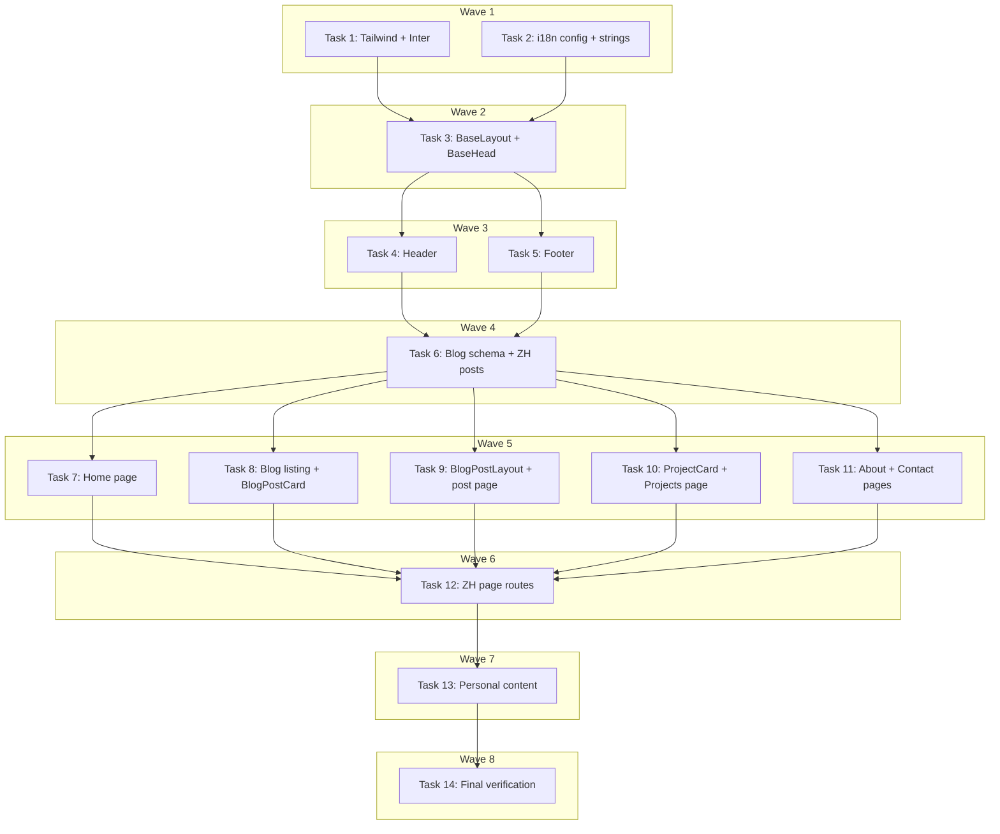

# Portfolio Redesign Implementation Plan

> **For Claude:** REQUIRED SUB-SKILL: Use executing-plans to implement this plan task-by-task.

**Design Doc:** [docs/designs/2026-03-13-portfolio-redesign-design.md](docs/designs/2026-03-13-portfolio-redesign-design.md)

**Spec References:** —

**PRD References:** —

**Goal:** Replace the generic Astro blog template styling with a clean, minimal Tailwind CSS design and add bilingual support (English / Traditional Chinese) using Astro 5 native i18n routing.

**Architecture:** Add Tailwind CSS v4 via the `@tailwindcss/vite` Vite plugin (no config file — theme defined in CSS). Add Astro 5's native i18n with `prefixDefaultLocale: false` so English has no URL prefix and Chinese lives under `/zh/`. Blog posts include a `lang` frontmatter field; Chinese posts live in `src/content/blog/zh/`. All UI strings (nav labels, CTAs, headings) live in `src/i18n/ui.ts` and are accessed via `useTranslations()`.

**Tech Stack:** Astro 5, Tailwind CSS v4 (`@tailwindcss/vite`), `@fontsource-variable/inter`, Astro i18n (native), TypeScript

**Acceptance Criteria:**
- [ ] Visitor sees a clean minimal home page with text hero (no avatar), recent posts, and featured projects
- [ ] Visitor can toggle between English and 中文 in the nav and see ZH UI strings and ZH blog post
- [ ] Blog listing is a clean chronological list with no tag filter UI; pinned posts appear first with a dot marker
- [ ] Projects page shows a card grid with subtle hover lift effect
- [ ] All pages have correct `lang` attribute (`en` or `zh-TW`) and `hreflang` alternate tags in `<head>`
- [ ] Build passes with 0 type errors and 0 warnings

---

## Task 1: Install Tailwind CSS v4 and Inter variable font

**Files:**
- Modify: `astro.config.mjs`
- Modify: `src/styles/global.css`
- Modify: `package.json` (via npm install)

**Note:** No unit test — verification is `npm run build` succeeding.

**Step 1: Install packages**

```bash
npm install @tailwindcss/vite tailwindcss
npm install @fontsource-variable/inter
```

**Step 2: Update `astro.config.mjs` to use Tailwind v4 Vite plugin**

```js
// @ts-check
import mdx from '@astrojs/mdx';
import sitemap from '@astrojs/sitemap';
import tailwindcss from '@tailwindcss/vite';
import { defineConfig } from 'astro/config';

export default defineConfig({
  site: 'https://ytchou.github.io',
  integrations: [mdx(), sitemap()],
  vite: {
    plugins: [tailwindcss()],
  },
});
```

**Step 3: Replace `src/styles/global.css`**

```css
@import "tailwindcss";
@import "@fontsource-variable/inter";

@theme {
  --color-accent: #4f46e5;
  --color-accent-hover: #4338ca;
  --color-muted: #6b7280;
  --color-border: #e5e7eb;
  --font-sans: 'Inter Variable', ui-sans-serif, system-ui, sans-serif;
}

html {
  background-color: #fafafa;
  color: #111827;
  font-family: var(--font-sans);
  font-size: 18px;
  line-height: 1.7;
  -webkit-font-smoothing: antialiased;
}

body {
  margin: 0;
  min-height: 100vh;
  display: flex;
  flex-direction: column;
}

main {
  flex: 1;
}

/* Remove Tailwind's base link color override */
a {
  color: inherit;
}

/* Prose styles for blog post content */
.prose h1, .prose h2, .prose h3 { line-height: 1.3; margin-top: 2rem; margin-bottom: 0.5rem; }
.prose p { margin-bottom: 1.25rem; }
.prose a { color: var(--color-accent); text-decoration: underline; text-underline-offset: 3px; }
.prose code { font-size: 0.875em; background: #f3f4f6; padding: 0.15em 0.4em; border-radius: 4px; }
.prose pre { background: #f9fafb; border: 1px solid #e5e7eb; border-radius: 8px; padding: 1.25rem; overflow-x: auto; margin-bottom: 1.5rem; }
.prose pre code { background: none; padding: 0; font-size: 0.875em; }
.prose blockquote { border-left: 3px solid var(--color-border); padding-left: 1rem; color: var(--color-muted); margin: 1.5rem 0; }
.prose ul, .prose ol { padding-left: 1.5rem; margin-bottom: 1.25rem; }
.prose img { border-radius: 8px; }
```

**Step 4: Remove old `@font-face` blocks from `BaseHead.astro`**

The `BaseHead.astro` currently preloads Atkinson Hyperlegible fonts. Remove those `<link rel="preload">` and `@font-face` references since we're now using Inter via Fontsource (imported in CSS). Read `src/components/BaseHead.astro` and delete lines 35–38 (the font preload links).

**Step 5: Verify build passes**

```bash
npm run build 2>&1 | tail -5
```

Expected: `7 page(s) built`, no errors.

**Step 6: Commit**

```bash
git add astro.config.mjs src/styles/global.css package.json package-lock.json
git commit -m "feat: add Tailwind CSS v4 and Inter variable font"
```

---

## Task 2: Configure Astro i18n routing and create translation strings

**Files:**
- Modify: `astro.config.mjs`
- Create: `src/i18n/ui.ts`
- Create: `src/i18n/utils.ts`

**Note:** No unit test — verification is `npx astro check` with 0 errors.

**Step 1: Update `astro.config.mjs` to add i18n config**

```js
// @ts-check
import mdx from '@astrojs/mdx';
import sitemap from '@astrojs/sitemap';
import tailwindcss from '@tailwindcss/vite';
import { defineConfig } from 'astro/config';

export default defineConfig({
  site: 'https://ytchou.github.io',
  i18n: {
    defaultLocale: 'en',
    locales: ['en', 'zh'],
    routing: {
      prefixDefaultLocale: false,
    },
  },
  integrations: [mdx(), sitemap()],
  vite: {
    plugins: [tailwindcss()],
  },
});
```

**Step 2: Create `src/i18n/ui.ts`**

```ts
export const languages = {
  en: 'English',
  zh: '中文',
} as const;

export type Lang = keyof typeof languages;
export const defaultLang: Lang = 'en';

export const ui = {
  en: {
    'nav.home': 'Yung-Tang Chou',
    'nav.about': 'About',
    'nav.projects': 'Projects',
    'nav.blog': 'Blog',
    'nav.contact': 'Contact',
    'nav.lang-toggle': '中文',
    'hero.tagline': 'Software engineer based in Taiwan.',
    'hero.sub': 'Building products that matter.',
    'hero.cta.work': 'See my work',
    'hero.cta.contact': 'Get in touch',
    'home.writing': 'Recent Writing',
    'home.all-posts': 'All posts',
    'home.projects': 'Featured Projects',
    'home.all-projects': 'All projects',
    'blog.title': 'Blog',
    'blog.subtitle': 'Writing on software, products, and ideas.',
    'blog.pinned': 'Pinned',
    'projects.title': 'Projects',
    'projects.subtitle': 'A selection of things I\'ve built.',
    'projects.github': 'GitHub',
    'projects.live': 'Live',
    'about.title': 'About',
    'contact.title': 'Contact',
    'contact.intro': 'The best way to reach me is email.',
    'contact.coffee': 'Coffee chat',
    'contact.coffee-body': 'Happy to chat about software, projects, or career advice.',
    'contact.book': 'Book a coffee chat',
    'footer.rights': '© {year} Yung-Tang Chou',
  },
  zh: {
    'nav.home': '周永唐',
    'nav.about': '關於',
    'nav.projects': '專案',
    'nav.blog': '文章',
    'nav.contact': '聯絡',
    'nav.lang-toggle': 'English',
    'hero.tagline': '台灣軟體工程師。',
    'hero.sub': '打造有意義的產品。',
    'hero.cta.work': '查看我的作品',
    'hero.cta.contact': '與我聯絡',
    'home.writing': '近期文章',
    'home.all-posts': '所有文章',
    'home.projects': '精選專案',
    'home.all-projects': '所有專案',
    'blog.title': '文章',
    'blog.subtitle': '關於軟體、產品與想法的文章。',
    'blog.pinned': '置頂',
    'projects.title': '專案',
    'projects.subtitle': '部分我建立過的作品。',
    'projects.github': 'GitHub',
    'projects.live': '展示',
    'about.title': '關於我',
    'contact.title': '聯絡',
    'contact.intro': '最快的聯絡方式是電子郵件。',
    'contact.coffee': '喝咖啡聊聊',
    'contact.coffee-body': '歡迎聊軟體、專案或職涯建議。',
    'contact.book': '預約咖啡聊聊',
    'footer.rights': '© {year} 周永唐',
  },
} as const;

export type UIKey = keyof typeof ui[typeof defaultLang];
```

**Step 3: Create `src/i18n/utils.ts`**

```ts
import { defaultLang, ui, type Lang, type UIKey } from './ui';

export function getLangFromUrl(url: URL): Lang {
  const [, maybeLang] = url.pathname.split('/');
  if (maybeLang === 'zh') return 'zh';
  return defaultLang;
}

export function useTranslations(lang: Lang) {
  return function t(key: UIKey): string {
    return (ui[lang] as Record<string, string>)[key]
      ?? (ui[defaultLang] as Record<string, string>)[key]
      ?? key;
  };
}

export function getAlternateLangUrl(url: URL, lang: Lang): string {
  const path = url.pathname;
  if (lang === 'zh') {
    return path.startsWith('/zh') ? path : `/zh${path === '/' ? '' : path}`;
  }
  return path.startsWith('/zh') ? path.slice(3) || '/' : path;
}
```

**Step 4: Run type check**

```bash
npx astro check 2>&1 | tail -5
```

Expected: `0 errors, 0 warnings, 0 hints`.

**Step 5: Commit**

```bash
git add astro.config.mjs src/i18n/
git commit -m "feat: configure Astro i18n routing and add EN/ZH translation strings"
```

---

## Task 3: Update BaseLayout and BaseHead with lang attr and hreflang

**Files:**
- Modify: `src/layouts/BaseLayout.astro`
- Modify: `src/components/BaseHead.astro`

**Note:** No unit test — verification is build + type check passing.

**Step 1: Update `src/layouts/BaseLayout.astro`**

```astro
---
import BaseHead from '../components/BaseHead.astro';
import Header from '../components/Header.astro';
import Footer from '../components/Footer.astro';
import '../styles/global.css';
import { getLangFromUrl } from '../i18n/utils';

interface Props {
  title: string;
  description?: string;
}

const { title, description = 'Software engineer based in Taiwan.' } = Astro.props;
const lang = getLangFromUrl(Astro.url);
const htmlLang = lang === 'zh' ? 'zh-TW' : 'en';
---

<!doctype html>
<html lang={htmlLang}>
  <head>
    <BaseHead title={title} description={description} lang={lang} />
  </head>
  <body>
    <Header />
    <main class="max-w-[720px] mx-auto px-6 py-12">
      <slot />
    </main>
    <Footer />
  </body>
</html>
```

**Step 2: Update `src/components/BaseHead.astro`**

Replace the full file:

```astro
---
import type { ImageMetadata } from 'astro';
import FallbackImage from '../assets/blog-placeholder-1.jpg';
import { SITE_TITLE } from '../consts';
import type { Lang } from '../i18n/ui';

interface Props {
  title: string;
  description: string;
  image?: ImageMetadata;
  lang?: Lang;
}

const { title, description, image = FallbackImage, lang = 'en' } = Astro.props;
const canonicalURL = new URL(Astro.url.pathname, Astro.site);

// Build hreflang alternates
const enUrl = new URL(
  Astro.url.pathname.startsWith('/zh')
    ? Astro.url.pathname.slice(3) || '/'
    : Astro.url.pathname,
  Astro.site
);
const zhUrl = new URL(
  Astro.url.pathname.startsWith('/zh')
    ? Astro.url.pathname
    : `/zh${Astro.url.pathname === '/' ? '' : Astro.url.pathname}`,
  Astro.site
);
---

<!-- Global Metadata -->
<meta charset="utf-8" />
<meta name="viewport" content="width=device-width,initial-scale=1" />
<link rel="icon" type="image/svg+xml" href="/favicon.svg" />
<link rel="icon" href="/favicon.ico" />
<link rel="sitemap" href="/sitemap-index.xml" />
<link rel="alternate" type="application/rss+xml" title={SITE_TITLE} href={new URL('rss.xml', Astro.site)} />
<meta name="generator" content={Astro.generator} />

<!-- Canonical + hreflang -->
<link rel="canonical" href={canonicalURL} />
<link rel="alternate" hreflang="en" href={enUrl} />
<link rel="alternate" hreflang="zh-TW" href={zhUrl} />
<link rel="alternate" hreflang="x-default" href={enUrl} />

<!-- Primary Meta -->
<title>{title}</title>
<meta name="description" content={description} />

<!-- Open Graph -->
<meta property="og:type" content="website" />
<meta property="og:url" content={Astro.url} />
<meta property="og:title" content={title} />
<meta property="og:description" content={description} />
<meta property="og:image" content={new URL(image.src, Astro.url)} />

<!-- Twitter -->
<meta property="twitter:card" content="summary_large_image" />
<meta property="twitter:url" content={Astro.url} />
<meta property="twitter:title" content={title} />
<meta property="twitter:description" content={description} />
<meta property="twitter:image" content={new URL(image.src, Astro.url)} />
```

**Step 3: Verify**

```bash
npx astro check 2>&1 | tail -5 && npm run build 2>&1 | tail -5
```

Expected: 0 errors, build completes.

**Step 4: Commit**

```bash
git add src/layouts/BaseLayout.astro src/components/BaseHead.astro
git commit -m "feat: add lang attr and hreflang to BaseLayout and BaseHead"
```

---

## Task 4: Redesign Header with Tailwind and language toggle

**Files:**
- Modify: `src/components/Header.astro`
- Modify: `src/components/HeaderLink.astro`

**Note:** No unit test — verification is build passing.

**Step 1: Replace `src/components/Header.astro`**

```astro
---
import { getLangFromUrl, getAlternateLangUrl, useTranslations } from '../i18n/utils';

const lang = getLangFromUrl(Astro.url);
const t = useTranslations(lang);
const altLangUrl = getAlternateLangUrl(Astro.url, lang === 'en' ? 'zh' : 'en');
const base = lang === 'zh' ? '/zh' : '';
---

<header class="sticky top-0 z-10 bg-[#fafafa]/95 backdrop-blur-sm border-b border-gray-100">
  <nav class="max-w-[720px] mx-auto px-6 py-4 flex items-center justify-between">
    <a href={`${base}/`} class="font-semibold text-gray-900 hover:text-indigo-600 transition-colors text-sm">
      {t('nav.home')}
    </a>
    <div class="flex items-center gap-1">
      <div class="hidden sm:flex items-center">
        <a href={`${base}/about`} class="px-3 py-1.5 text-sm text-gray-500 hover:text-gray-900 transition-colors rounded-md hover:bg-gray-100">{t('nav.about')}</a>
        <a href={`${base}/projects`} class="px-3 py-1.5 text-sm text-gray-500 hover:text-gray-900 transition-colors rounded-md hover:bg-gray-100">{t('nav.projects')}</a>
        <a href={`${base}/blog`} class="px-3 py-1.5 text-sm text-gray-500 hover:text-gray-900 transition-colors rounded-md hover:bg-gray-100">{t('nav.blog')}</a>
        <a href={`${base}/contact`} class="px-3 py-1.5 text-sm text-gray-500 hover:text-gray-900 transition-colors rounded-md hover:bg-gray-100">{t('nav.contact')}</a>
      </div>
      <a
        href={altLangUrl}
        class="ml-3 text-xs font-medium px-2.5 py-1 rounded-md border border-gray-200 text-gray-500 hover:border-indigo-300 hover:text-indigo-600 transition-colors"
      >
        {t('nav.lang-toggle')}
      </a>
    </div>
  </nav>
</header>
```

**Step 2: Delete `src/components/HeaderLink.astro`**

It's no longer used — the header inlines all nav links directly.

```bash
rm src/components/HeaderLink.astro
```

**Step 3: Verify**

```bash
npx astro check 2>&1 | tail -5 && npm run build 2>&1 | tail -5
```

Expected: 0 errors. If `HeaderLink` is still imported somewhere, fix those imports.

**Step 4: Commit**

```bash
git add src/components/Header.astro src/components/HeaderLink.astro
git commit -m "feat: redesign Header with Tailwind and language toggle"
```

---

## Task 5: Redesign Footer

**Files:**
- Modify: `src/components/Footer.astro`

**Note:** No unit test — build verification.

**Step 1: Replace `src/components/Footer.astro`**

```astro
---
import { getLangFromUrl, useTranslations } from '../i18n/utils';

const lang = getLangFromUrl(Astro.url);
const t = useTranslations(lang);
const year = new Date().getFullYear();
const rights = t('footer.rights').replace('{year}', String(year));
---

<footer class="border-t border-gray-100 mt-20">
  <div class="max-w-[720px] mx-auto px-6 py-8 flex items-center justify-between">
    <p class="text-sm text-gray-400">{rights}</p>
    <p class="text-sm text-gray-400">Yung-Tang Chou · 周永唐</p>
  </div>
</footer>
```

**Step 2: Verify and commit**

```bash
npx astro check 2>&1 | tail -5 && npm run build 2>&1 | tail -5
git add src/components/Footer.astro
git commit -m "feat: redesign Footer with Tailwind and bilingual name"
```

---

## Task 6: Update blog Content Collection schema (add `lang` and `pinned` fields)

**Files:**
- Modify: `src/content.config.ts`
- Create: `src/content/blog/zh/hello-world.md`
- Create: `src/content/blog/zh/why-i-built-this-site.md`
- Modify: `src/content/blog/hello-world.md` (add lang field)
- Modify: `src/content/blog/why-i-built-this-site.md` (add lang field)

**Note:** The Zod schema validates at build time — this IS the test. Verification: build passes.

**Step 1: Update `src/content.config.ts`**

```ts
import { defineCollection } from 'astro:content';
import { glob } from 'astro/loaders';
import { z } from 'astro/zod';

const blog = defineCollection({
  loader: glob({ base: './src/content/blog', pattern: '**/*.{md,mdx}' }),
  schema: z.object({
    title: z.string(),
    description: z.string(),
    date: z.coerce.date(),
    tags: z.array(z.string()).default([]),
    draft: z.boolean().default(false),
    lang: z.enum(['en', 'zh']).default('en'),
    pinned: z.boolean().default(false),
  }),
});

export const collections = { blog };
```

**Step 2: Update existing EN posts to add `lang: en`**

Add `lang: en` to the frontmatter of `src/content/blog/hello-world.md`:

```markdown
---
title: Hello World
description: My first post on this site.
date: 2026-03-13
tags: [general]
lang: en
pinned: true
---

Welcome to my personal site. I'll be writing about software, projects, and things I find interesting.
```

Add `lang: en` to `src/content/blog/why-i-built-this-site.md`:

```markdown
---
title: Why I Built This Site
description: The story behind this personal website and what I plan to use it for.
date: 2026-03-13
tags: [meta, personal]
lang: en
---

I've been meaning to have a personal site for a while. Here's why I finally did it.
```

**Step 3: Create ZH blog posts**

Create `src/content/blog/zh/hello-world.md`:

```markdown
---
title: 哈囉，世界
description: 這個網站的第一篇文章。
date: 2026-03-13
tags: [一般]
lang: zh
pinned: true
---

歡迎來到我的個人網站。我會在這裡寫關於軟體、專案，以及我覺得有趣的事情。
```

Create `src/content/blog/zh/why-i-built-this-site.md`:

```markdown
---
title: 為什麼我建立這個網站
description: 這個個人網站背後的故事，以及我打算如何使用它。
date: 2026-03-13
tags: [想法, 個人]
lang: zh
---

我很早就想有一個個人網站了。以下是我終於動手做的原因。
```

**Step 4: Verify**

```bash
npm run build 2>&1 | tail -5
```

Expected: build passes with more pages (ZH posts included in collection).

**Step 5: Commit**

```bash
git add src/content.config.ts src/content/blog/
git commit -m "feat: add lang and pinned fields to blog schema, add ZH sample posts"
```

---

## Task 7: Redesign Home page

**Files:**
- Modify: `src/pages/index.astro`

**Note:** No unit test — build verification + `dist/index.html` exists.

**Step 1: Replace `src/pages/index.astro`**

```astro
---
import { getCollection } from 'astro:content';
import BaseLayout from '../layouts/BaseLayout.astro';
import ProjectCard from '../components/ProjectCard.astro';
import { projects } from '../data/projects';
import { useTranslations } from '../i18n/utils';

const t = useTranslations('en');

const allPosts = await getCollection('blog', ({ data }) => data.lang === 'en' && !data.draft);
const latestPosts = allPosts
  .sort((a, b) => {
    if (a.data.pinned !== b.data.pinned) return a.data.pinned ? -1 : 1;
    return b.data.date.valueOf() - a.data.date.valueOf();
  })
  .slice(0, 3);

const featuredProjects = projects.filter(p => p.featured);
---

<BaseLayout title="Yung-Tang Chou" description={t('hero.tagline')}>
  <!-- Hero -->
  <section class="py-16 border-b border-gray-100">
    <h1 class="text-4xl font-bold text-gray-900 mb-3 tracking-tight">Yung-Tang Chou</h1>
    <p class="text-lg text-gray-500 mb-1">{t('hero.tagline')}</p>
    <p class="text-lg text-gray-500 mb-8">{t('hero.sub')}</p>
    <div class="flex gap-3">
      <a href="/projects" class="inline-flex items-center gap-1.5 px-4 py-2 bg-indigo-600 text-white text-sm font-medium rounded-lg hover:bg-indigo-700 transition-colors no-underline">
        {t('hero.cta.work')} ↗
      </a>
      <a href="/contact" class="inline-flex items-center px-4 py-2 border border-gray-200 text-gray-700 text-sm font-medium rounded-lg hover:border-gray-300 hover:bg-gray-50 transition-colors no-underline">
        {t('hero.cta.contact')}
      </a>
    </div>
  </section>

  <!-- Recent Writing -->
  <section class="py-12 border-b border-gray-100">
    <h2 class="text-sm font-semibold text-gray-400 uppercase tracking-wider mb-6">{t('home.writing')}</h2>
    <ul class="space-y-0">
      {latestPosts.map(post => (
        <li class="flex items-baseline justify-between py-3 border-b border-gray-50 last:border-0 group">
          <a href={`/blog/${post.id}`} class="text-gray-800 hover:text-indigo-600 transition-colors font-medium no-underline group-hover:underline underline-offset-4">
            {post.data.pinned && <span class="inline-block w-1.5 h-1.5 rounded-full bg-indigo-500 mr-2 mb-0.5 align-middle"></span>}
            {post.data.title}
          </a>
          <time class="text-sm text-gray-400 ml-4 shrink-0" datetime={post.data.date.toISOString()}>
            {post.data.date.toLocaleDateString('en-US', { month: 'short', day: 'numeric', year: 'numeric' })}
          </time>
        </li>
      ))}
    </ul>
    <a href="/blog" class="inline-block mt-5 text-sm text-indigo-600 hover:text-indigo-700 font-medium no-underline">{t('home.all-posts')} →</a>
  </section>

  <!-- Featured Projects -->
  <section class="py-12">
    <h2 class="text-sm font-semibold text-gray-400 uppercase tracking-wider mb-6">{t('home.projects')}</h2>
    <div class="grid grid-cols-1 md:grid-cols-2 gap-4">
      {featuredProjects.map(project => <ProjectCard project={project} />)}
    </div>
    <a href="/projects" class="inline-block mt-5 text-sm text-indigo-600 hover:text-indigo-700 font-medium no-underline">{t('home.all-projects')} →</a>
  </section>
</BaseLayout>
```

**Step 2: Verify**

```bash
npm run build 2>&1 | tail -5
```

Expected: `dist/index.html` exists, build clean.

**Step 3: Commit**

```bash
git add src/pages/index.astro
git commit -m "feat: redesign home page with Tailwind hero, recent posts, featured projects"
```

---

## Task 8: Redesign Blog listing page and BlogPostCard

**Files:**
- Modify: `src/pages/blog/index.astro`
- Modify: `src/components/BlogPostCard.astro`

**Note:** No unit test — build + `dist/blog/index.html` verification.

**Step 1: Replace `src/components/BlogPostCard.astro`**

```astro
---
interface Props {
  title: string;
  description: string;
  date: Date;
  id: string;
  pinned: boolean;
  lang?: string;
}
const { title, description, date, id, pinned, lang = 'en' } = Astro.props;
const basePath = lang === 'zh' ? '/zh/blog' : '/blog';
const slug = id.startsWith('zh/') ? id.slice(3) : id;
const formatted = date.toLocaleDateString(lang === 'zh' ? 'zh-TW' : 'en-US', {
  year: 'numeric', month: 'long', day: 'numeric'
});
---

<article class="py-5 border-b border-gray-100 last:border-0">
  <div class="flex items-start justify-between gap-4">
    <div class="flex-1 min-w-0">
      <a href={`${basePath}/${slug}`} class="group block">
        <h3 class="font-medium text-gray-900 group-hover:text-indigo-600 transition-colors mb-1 flex items-center gap-2">
          {pinned && <span class="inline-block w-1.5 h-1.5 rounded-full bg-indigo-500 shrink-0"></span>}
          {title}
        </h3>
        <p class="text-sm text-gray-500 line-clamp-2">{description}</p>
      </a>
    </div>
    <time class="text-sm text-gray-400 shrink-0 mt-0.5" datetime={date.toISOString()}>{formatted}</time>
  </div>
</article>
```

**Step 2: Replace `src/pages/blog/index.astro`**

```astro
---
import { getCollection } from 'astro:content';
import BaseLayout from '../../layouts/BaseLayout.astro';
import BlogPostCard from '../../components/BlogPostCard.astro';
import { useTranslations } from '../../i18n/utils';

const t = useTranslations('en');

const posts = (await getCollection('blog', ({ data }) => data.lang === 'en' && !data.draft))
  .sort((a, b) => {
    if (a.data.pinned !== b.data.pinned) return a.data.pinned ? -1 : 1;
    return b.data.date.valueOf() - a.data.date.valueOf();
  });
---

<BaseLayout title={`${t('blog.title')} — Yung-Tang Chou`} description={t('blog.subtitle')}>
  <div class="mb-10">
    <h1 class="text-3xl font-bold text-gray-900 tracking-tight mb-2">{t('blog.title')}</h1>
    <p class="text-gray-500">{t('blog.subtitle')}</p>
  </div>
  <div>
    {posts.map(post => (
      <BlogPostCard
        title={post.data.title}
        description={post.data.description}
        date={post.data.date}
        id={post.id}
        pinned={post.data.pinned}
        lang="en"
      />
    ))}
  </div>
</BaseLayout>
```

**Step 3: Verify**

```bash
npm run build 2>&1 | tail -5
```

Expected: `dist/blog/index.html` exists.

**Step 4: Commit**

```bash
git add src/pages/blog/index.astro src/components/BlogPostCard.astro
git commit -m "feat: redesign blog listing page and BlogPostCard with Tailwind"
```

---

## Task 9: Redesign BlogPostLayout and individual post page

**Files:**
- Modify: `src/layouts/BlogPostLayout.astro`
- Modify: `src/pages/blog/[slug].astro`

**Note:** No unit test — `dist/blog/hello-world/index.html` must exist.

**Step 1: Replace `src/layouts/BlogPostLayout.astro`**

```astro
---
import BaseLayout from './BaseLayout.astro';
import { SITE_TITLE } from '../consts';

interface Props {
  title: string;
  description: string;
  date: Date;
  tags: string[];
  lang?: string;
}
const { title, description, date, tags, lang = 'en' } = Astro.props;
const formatted = date.toLocaleDateString(lang === 'zh' ? 'zh-TW' : 'en-US', {
  year: 'numeric', month: 'long', day: 'numeric'
});
---

<BaseLayout title={`${title} — ${SITE_TITLE}`} description={description}>
  <article>
    <header class="mb-10 pb-8 border-b border-gray-100">
      <h1 class="text-3xl font-bold text-gray-900 tracking-tight mb-3">{title}</h1>
      <div class="flex items-center gap-4 flex-wrap">
        <time class="text-sm text-gray-400" datetime={date.toISOString()}>{formatted}</time>
        {tags.length > 0 && (
          <ul class="flex flex-wrap gap-1.5 list-none p-0 m-0">
            {tags.map(tag => (
              <li class="text-xs px-2 py-0.5 bg-gray-100 text-gray-500 rounded-full">{tag}</li>
            ))}
          </ul>
        )}
      </div>
    </header>
    <div class="prose prose-gray max-w-none">
      <slot />
    </div>
  </article>
</BaseLayout>
```

**Step 2: Update `src/pages/blog/[slug].astro`**

```astro
---
import { getCollection, render } from 'astro:content';
import BlogPostLayout from '../../layouts/BlogPostLayout.astro';

export async function getStaticPaths() {
  const posts = await getCollection('blog', ({ data }) => data.lang === 'en' && !data.draft);
  return posts.map(post => ({
    params: { slug: post.id },
    props: { post },
  }));
}

const { post } = Astro.props;
const { Content } = await render(post);
---

<BlogPostLayout
  title={post.data.title}
  description={post.data.description}
  date={post.data.date}
  tags={post.data.tags}
  lang="en"
>
  <Content />
</BlogPostLayout>
```

**Step 3: Verify**

```bash
npm run build 2>&1 | tail -5
ls dist/blog/
```

Expected: `hello-world/` and `why-i-built-this-site/` exist.

**Step 4: Commit**

```bash
git add src/layouts/BlogPostLayout.astro src/pages/blog/[slug].astro
git commit -m "feat: redesign BlogPostLayout and individual post page with Tailwind"
```

---

## Task 10: Redesign ProjectCard and Projects page

**Files:**
- Modify: `src/components/ProjectCard.astro`
- Modify: `src/pages/projects.astro`

**Note:** No unit test — `dist/projects/index.html` must exist.

**Step 1: Replace `src/components/ProjectCard.astro`**

```astro
---
import type { Project } from '../data/projects';

interface Props {
  project: Project;
  lang?: string;
}
const { project, lang = 'en' } = Astro.props;
---

<article class="group border border-gray-200 rounded-xl p-5 hover:border-indigo-200 hover:shadow-sm transition-all duration-200 flex flex-col gap-3">
  <h3 class="font-semibold text-gray-900 group-hover:text-indigo-600 transition-colors mt-0">{project.title}</h3>
  <p class="text-sm text-gray-500 leading-relaxed flex-1">{project.description}</p>
  <ul class="flex flex-wrap gap-1.5 list-none p-0 m-0">
    {project.tags.map(tag => (
      <li class="text-xs px-2 py-0.5 bg-gray-100 text-gray-600 rounded-full">{tag}</li>
    ))}
  </ul>
  <div class="flex gap-3 pt-1">
    {project.githubUrl && (
      <a href={project.githubUrl} target="_blank" rel="noopener" class="text-xs font-medium text-gray-500 hover:text-indigo-600 transition-colors no-underline">
        GitHub ↗
      </a>
    )}
    {project.liveUrl && (
      <a href={project.liveUrl} target="_blank" rel="noopener" class="text-xs font-medium text-gray-500 hover:text-indigo-600 transition-colors no-underline">
        {lang === 'zh' ? '展示 ↗' : 'Live ↗'}
      </a>
    )}
  </div>
</article>
```

**Step 2: Replace `src/pages/projects.astro`**

```astro
---
import BaseLayout from '../layouts/BaseLayout.astro';
import ProjectCard from '../components/ProjectCard.astro';
import { projects } from '../data/projects';
import { useTranslations } from '../i18n/utils';

const t = useTranslations('en');
---

<BaseLayout title={`${t('projects.title')} — Yung-Tang Chou`} description={t('projects.subtitle')}>
  <div class="mb-10">
    <h1 class="text-3xl font-bold text-gray-900 tracking-tight mb-2">{t('projects.title')}</h1>
    <p class="text-gray-500">{t('projects.subtitle')}</p>
  </div>
  <div class="grid grid-cols-1 md:grid-cols-2 gap-4">
    {projects.map(project => <ProjectCard project={project} />)}
  </div>
</BaseLayout>
```

**Step 3: Verify and commit**

```bash
npm run build 2>&1 | tail -5
git add src/components/ProjectCard.astro src/pages/projects.astro
git commit -m "feat: redesign ProjectCard and Projects page with Tailwind hover effects"
```

---

## Task 11: Redesign About and Contact pages

**Files:**
- Modify: `src/pages/about.astro`
- Modify: `src/pages/contact.astro`

**Note:** No unit test — build verification.

**Step 1: Replace `src/pages/about.astro`**

```astro
---
import BaseLayout from '../layouts/BaseLayout.astro';
import { useTranslations } from '../i18n/utils';

const t = useTranslations('en');
const skills = ['TypeScript', 'Python', 'React', 'Node.js', 'SQL', 'Docker'];
---

<BaseLayout title={`${t('about.title')} — Yung-Tang Chou`} description="A bit about me.">
  <h1 class="text-3xl font-bold text-gray-900 tracking-tight mb-8">{t('about.title')}</h1>

  <section class="mb-10 space-y-4 text-gray-600 leading-relaxed">
    <p>
      I'm a software engineer based in Taiwan. I work on [what you do].
      Previously at [Company/School]. I care about [values/interests].
    </p>
    <p>Outside of work, I [hobbies/interests].</p>
  </section>

  <section>
    <h2 class="text-sm font-semibold text-gray-400 uppercase tracking-wider mb-4">Skills</h2>
    <ul class="flex flex-wrap gap-2 list-none p-0 m-0">
      {skills.map(skill => (
        <li class="px-3 py-1 bg-gray-100 text-gray-700 text-sm rounded-full">{skill}</li>
      ))}
    </ul>
  </section>
</BaseLayout>
```

**Step 2: Replace `src/pages/contact.astro`**

```astro
---
import BaseLayout from '../layouts/BaseLayout.astro';
import { useTranslations } from '../i18n/utils';

const t = useTranslations('en');

const links = [
  { label: 'Email', href: 'mailto:you@example.com', display: 'you@example.com', external: false },
  { label: 'GitHub', href: 'https://github.com/ytchou', display: 'github.com/ytchou', external: true },
  { label: 'LinkedIn', href: 'https://linkedin.com/in/yourname', display: 'linkedin.com/in/yourname', external: true },
];
const calendlyUrl = 'https://calendly.com/yourname/coffee-chat';
---

<BaseLayout title={`${t('contact.title')} — Yung-Tang Chou`} description={t('contact.intro')}>
  <h1 class="text-3xl font-bold text-gray-900 tracking-tight mb-4">{t('contact.title')}</h1>
  <p class="text-gray-500 mb-8">{t('contact.intro')}</p>

  <ul class="space-y-3 list-none p-0 mb-12">
    {links.map(link => (
      <li class="flex items-center gap-3">
        <span class="text-sm font-medium text-gray-700 w-16">{link.label}</span>
        <a
          href={link.href}
          {...(link.external ? { target: '_blank', rel: 'noopener' } : {})}
          class="text-sm text-indigo-600 hover:text-indigo-700 no-underline hover:underline underline-offset-4"
        >
          {link.display}
        </a>
      </li>
    ))}
  </ul>

  <section class="border-t border-gray-100 pt-8">
    <h2 class="text-lg font-semibold text-gray-900 mb-2">{t('contact.coffee')}</h2>
    <p class="text-gray-500 text-sm mb-4">{t('contact.coffee-body')}</p>
    <a
      href={calendlyUrl}
      target="_blank"
      rel="noopener"
      class="inline-flex items-center px-4 py-2 bg-indigo-600 text-white text-sm font-medium rounded-lg hover:bg-indigo-700 transition-colors no-underline"
    >
      {t('contact.book')}
    </a>
  </section>
</BaseLayout>
```

**Step 3: Verify and commit**

```bash
npm run build 2>&1 | tail -5
git add src/pages/about.astro src/pages/contact.astro
git commit -m "feat: redesign About and Contact pages with Tailwind"
```

---

## Task 12: Create ZH page routes

**Files:**
- Create: `src/pages/zh/index.astro`
- Create: `src/pages/zh/about.astro`
- Create: `src/pages/zh/projects.astro`
- Create: `src/pages/zh/contact.astro`
- Create: `src/pages/zh/blog/index.astro`
- Create: `src/pages/zh/blog/[slug].astro`

**Note:** No unit test — build verification. All ZH routes must appear in `dist/zh/`.

**Step 1: Create `src/pages/zh/index.astro`** (ZH home page)

```astro
---
import { getCollection } from 'astro:content';
import BaseLayout from '../../layouts/BaseLayout.astro';
import ProjectCard from '../../components/ProjectCard.astro';
import { projects } from '../../data/projects';
import { useTranslations } from '../../i18n/utils';

const t = useTranslations('zh');

const allPosts = await getCollection('blog', ({ data }) => data.lang === 'zh' && !data.draft);
const latestPosts = allPosts
  .sort((a, b) => {
    if (a.data.pinned !== b.data.pinned) return a.data.pinned ? -1 : 1;
    return b.data.date.valueOf() - a.data.date.valueOf();
  })
  .slice(0, 3);

const featuredProjects = projects.filter(p => p.featured);
---

<BaseLayout title="周永唐" description={t('hero.tagline')}>
  <section class="py-16 border-b border-gray-100">
    <h1 class="text-4xl font-bold text-gray-900 mb-3 tracking-tight">周永唐</h1>
    <p class="text-lg text-gray-500 mb-1">{t('hero.tagline')}</p>
    <p class="text-lg text-gray-500 mb-8">{t('hero.sub')}</p>
    <div class="flex gap-3">
      <a href="/zh/projects" class="inline-flex items-center gap-1.5 px-4 py-2 bg-indigo-600 text-white text-sm font-medium rounded-lg hover:bg-indigo-700 transition-colors no-underline">
        {t('hero.cta.work')} ↗
      </a>
      <a href="/zh/contact" class="inline-flex items-center px-4 py-2 border border-gray-200 text-gray-700 text-sm font-medium rounded-lg hover:border-gray-300 hover:bg-gray-50 transition-colors no-underline">
        {t('hero.cta.contact')}
      </a>
    </div>
  </section>

  <section class="py-12 border-b border-gray-100">
    <h2 class="text-sm font-semibold text-gray-400 uppercase tracking-wider mb-6">{t('home.writing')}</h2>
    <ul class="space-y-0">
      {latestPosts.map(post => {
        const slug = post.id.startsWith('zh/') ? post.id.slice(3) : post.id;
        return (
          <li class="flex items-baseline justify-between py-3 border-b border-gray-50 last:border-0 group">
            <a href={`/zh/blog/${slug}`} class="text-gray-800 hover:text-indigo-600 transition-colors font-medium no-underline group-hover:underline underline-offset-4">
              {post.data.pinned && <span class="inline-block w-1.5 h-1.5 rounded-full bg-indigo-500 mr-2 mb-0.5 align-middle"></span>}
              {post.data.title}
            </a>
            <time class="text-sm text-gray-400 ml-4 shrink-0" datetime={post.data.date.toISOString()}>
              {post.data.date.toLocaleDateString('zh-TW', { month: 'short', day: 'numeric', year: 'numeric' })}
            </time>
          </li>
        );
      })}
    </ul>
    <a href="/zh/blog" class="inline-block mt-5 text-sm text-indigo-600 hover:text-indigo-700 font-medium no-underline">{t('home.all-posts')} →</a>
  </section>

  <section class="py-12">
    <h2 class="text-sm font-semibold text-gray-400 uppercase tracking-wider mb-6">{t('home.projects')}</h2>
    <div class="grid grid-cols-1 md:grid-cols-2 gap-4">
      {featuredProjects.map(project => <ProjectCard project={project} lang="zh" />)}
    </div>
    <a href="/zh/projects" class="inline-block mt-5 text-sm text-indigo-600 hover:text-indigo-700 font-medium no-underline">{t('home.all-projects')} →</a>
  </section>
</BaseLayout>
```

**Step 2: Create `src/pages/zh/blog/index.astro`**

```astro
---
import { getCollection } from 'astro:content';
import BaseLayout from '../../../layouts/BaseLayout.astro';
import BlogPostCard from '../../../components/BlogPostCard.astro';
import { useTranslations } from '../../../i18n/utils';

const t = useTranslations('zh');

const posts = (await getCollection('blog', ({ data }) => data.lang === 'zh' && !data.draft))
  .sort((a, b) => {
    if (a.data.pinned !== b.data.pinned) return a.data.pinned ? -1 : 1;
    return b.data.date.valueOf() - a.data.date.valueOf();
  });
---

<BaseLayout title={`${t('blog.title')} — 周永唐`} description={t('blog.subtitle')}>
  <div class="mb-10">
    <h1 class="text-3xl font-bold text-gray-900 tracking-tight mb-2">{t('blog.title')}</h1>
    <p class="text-gray-500">{t('blog.subtitle')}</p>
  </div>
  <div>
    {posts.map(post => (
      <BlogPostCard
        title={post.data.title}
        description={post.data.description}
        date={post.data.date}
        id={post.id}
        pinned={post.data.pinned}
        lang="zh"
      />
    ))}
  </div>
</BaseLayout>
```

**Step 3: Create `src/pages/zh/blog/[slug].astro`**

```astro
---
import { getCollection, render } from 'astro:content';
import BlogPostLayout from '../../../layouts/BlogPostLayout.astro';

export async function getStaticPaths() {
  const posts = await getCollection('blog', ({ data }) => data.lang === 'zh' && !data.draft);
  return posts.map(post => ({
    params: { slug: post.id.startsWith('zh/') ? post.id.slice(3) : post.id },
    props: { post },
  }));
}

const { post } = Astro.props;
const { Content } = await render(post);
---

<BlogPostLayout
  title={post.data.title}
  description={post.data.description}
  date={post.data.date}
  tags={post.data.tags}
  lang="zh"
>
  <Content />
</BlogPostLayout>
```

**Step 4: Create `src/pages/zh/about.astro`**

```astro
---
import BaseLayout from '../../layouts/BaseLayout.astro';
import { useTranslations } from '../../i18n/utils';

const t = useTranslations('zh');
const skills = ['TypeScript', 'Python', 'React', 'Node.js', 'SQL', 'Docker'];
---

<BaseLayout title={`${t('about.title')} — 周永唐`} description="關於我。">
  <h1 class="text-3xl font-bold text-gray-900 tracking-tight mb-8">{t('about.title')}</h1>
  <section class="mb-10 space-y-4 text-gray-600 leading-relaxed">
    <p>我是一位台灣的軟體工程師。我專注於 [您的工作領域]。曾任職於 [公司/學校]。我重視 [價值觀/興趣]。</p>
    <p>工作之外，我喜歡 [興趣/嗜好]。</p>
  </section>
  <section>
    <h2 class="text-sm font-semibold text-gray-400 uppercase tracking-wider mb-4">技能</h2>
    <ul class="flex flex-wrap gap-2 list-none p-0 m-0">
      {skills.map(skill => (
        <li class="px-3 py-1 bg-gray-100 text-gray-700 text-sm rounded-full">{skill}</li>
      ))}
    </ul>
  </section>
</BaseLayout>
```

**Step 5: Create `src/pages/zh/projects.astro`**

```astro
---
import BaseLayout from '../../layouts/BaseLayout.astro';
import ProjectCard from '../../components/ProjectCard.astro';
import { projects } from '../../data/projects';
import { useTranslations } from '../../i18n/utils';

const t = useTranslations('zh');
---

<BaseLayout title={`${t('projects.title')} — 周永唐`} description={t('projects.subtitle')}>
  <div class="mb-10">
    <h1 class="text-3xl font-bold text-gray-900 tracking-tight mb-2">{t('projects.title')}</h1>
    <p class="text-gray-500">{t('projects.subtitle')}</p>
  </div>
  <div class="grid grid-cols-1 md:grid-cols-2 gap-4">
    {projects.map(project => <ProjectCard project={project} lang="zh" />)}
  </div>
</BaseLayout>
```

**Step 6: Create `src/pages/zh/contact.astro`**

```astro
---
import BaseLayout from '../../layouts/BaseLayout.astro';
import { useTranslations } from '../../i18n/utils';

const t = useTranslations('zh');
const links = [
  { label: '電子郵件', href: 'mailto:you@example.com', display: 'you@example.com', external: false },
  { label: 'GitHub', href: 'https://github.com/ytchou', display: 'github.com/ytchou', external: true },
  { label: 'LinkedIn', href: 'https://linkedin.com/in/yourname', display: 'linkedin.com/in/yourname', external: true },
];
const calendlyUrl = 'https://calendly.com/yourname/coffee-chat';
---

<BaseLayout title={`${t('contact.title')} — 周永唐`} description={t('contact.intro')}>
  <h1 class="text-3xl font-bold text-gray-900 tracking-tight mb-4">{t('contact.title')}</h1>
  <p class="text-gray-500 mb-8">{t('contact.intro')}</p>
  <ul class="space-y-3 list-none p-0 mb-12">
    {links.map(link => (
      <li class="flex items-center gap-3">
        <span class="text-sm font-medium text-gray-700 w-20">{link.label}</span>
        <a href={link.href} {...(link.external ? { target: '_blank', rel: 'noopener' } : {})}
          class="text-sm text-indigo-600 hover:text-indigo-700 no-underline hover:underline underline-offset-4">
          {link.display}
        </a>
      </li>
    ))}
  </ul>
  <section class="border-t border-gray-100 pt-8">
    <h2 class="text-lg font-semibold text-gray-900 mb-2">{t('contact.coffee')}</h2>
    <p class="text-gray-500 text-sm mb-4">{t('contact.coffee-body')}</p>
    <a href={calendlyUrl} target="_blank" rel="noopener"
      class="inline-flex items-center px-4 py-2 bg-indigo-600 text-white text-sm font-medium rounded-lg hover:bg-indigo-700 transition-colors no-underline">
      {t('contact.book')}
    </a>
  </section>
</BaseLayout>
```

**Step 7: Verify all ZH routes**

```bash
npm run build 2>&1 | tail -5
ls dist/zh/
ls dist/zh/blog/
```

Expected: `dist/zh/index.html`, `dist/zh/blog/index.html`, `dist/zh/blog/hello-world/index.html` all exist.

**Step 8: Commit**

```bash
git add src/pages/zh/
git commit -m "feat: add ZH page routes for all pages and blog"
```

---

## Task 13: Update personal content (name, bio, links)

**Files:**
- Modify: `src/consts.ts`
- Modify: `src/data/projects.ts`
- Modify: `src/pages/about.astro` (bio text)
- Modify: `src/pages/zh/about.astro` (bio text)
- Modify: `src/pages/contact.astro` (email, LinkedIn)
- Modify: `src/pages/zh/contact.astro` (email, LinkedIn)

**Note:** No unit test — content changes only.

**Step 1: Update `src/consts.ts`**

```ts
export const SITE_TITLE = 'Yung-Tang Chou';
export const SITE_DESCRIPTION = 'Software engineer based in Taiwan.';
```

**Step 2: Update `src/data/projects.ts`** — fix GitHub URLs to use `ytchou`

```ts
export interface Project {
  title: string;
  description: string;
  tags: string[];
  githubUrl?: string;
  liveUrl?: string;
  featured: boolean;
}

export const projects: Project[] = [
  {
    title: 'Project One',
    description: 'A short description of what this project does and why it matters.',
    tags: ['TypeScript', 'React', 'Node.js'],
    githubUrl: 'https://github.com/ytchou/project-one',
    liveUrl: 'https://project-one.example.com',
    featured: true,
  },
  {
    title: 'Project Two',
    description: 'Another project — replace this with your real work.',
    tags: ['Python', 'FastAPI'],
    githubUrl: 'https://github.com/ytchou/project-two',
    featured: false,
  },
];
```

**Step 3: Final build and type check**

```bash
npx astro check 2>&1 | tail -5
npm run build 2>&1 | tail -5
```

Expected: 0 errors, all pages built.

**Step 4: Commit**

```bash
git add src/consts.ts src/data/projects.ts src/pages/about.astro src/pages/zh/about.astro src/pages/contact.astro src/pages/zh/contact.astro
git commit -m "chore: update personal content, name to Yung-Tang Chou, fix GitHub URLs"
```

---

## Task 14: Final verification — all routes, hreflang, push

**Note:** No new code — verification only.

**Step 1: Full type check + build**

```bash
npx astro check 2>&1 | tail -8
npm run build 2>&1 | tail -8
```

Expected: 0 errors, 0 warnings, all pages built.

**Step 2: Verify all expected routes exist**

```bash
ls dist/                     # index.html, about/, blog/, projects/, contact/, zh/
ls dist/zh/                  # index.html, about/, blog/, projects/, contact/
ls dist/blog/                # index.html, hello-world/, why-i-built-this-site/
ls dist/zh/blog/             # index.html, hello-world/, why-i-built-this-site/
```

**Step 3: Verify hreflang in built HTML**

```bash
grep -o 'hreflang="[^"]*"' dist/index.html
```

Expected output:
```
hreflang="en"
hreflang="zh-TW"
hreflang="x-default"
```

**Step 4: Verify lang attribute on html element**

```bash
grep '<html lang' dist/index.html
grep '<html lang' dist/zh/index.html
```

Expected:
```
<html lang="en">
<html lang="zh-TW">
```

**Step 5: Push and verify GitHub Actions**

```bash
git push
```

Check GitHub Actions tab — deploy workflow should pass and site should be live at `https://ytchou.github.io`.

**Step 6: Commit (if no changes needed)**

No commit needed — this is verification only. If fixes were required during verification, commit them:

```bash
git add -A
git commit -m "fix: final verification fixes"
```

---

## Execution Waves



**Wave 1** (parallel — no dependencies):
- Task 1: Install Tailwind CSS v4 and Inter font
- Task 2: Configure Astro i18n routing and translation strings

**Wave 2** (sequential — depends on Task 1 + Task 2):
- Task 3: Update BaseLayout and BaseHead with lang attr and hreflang

**Wave 3** (parallel — depends on Task 3):
- Task 4: Redesign Header with language toggle
- Task 5: Redesign Footer

**Wave 4** (sequential — depends on Wave 3, sets up content schema):
- Task 6: Update blog Content Collection schema (lang + pinned) and ZH posts

**Wave 5** (parallel — all depend on Task 6):
- Task 7: Redesign Home page
- Task 8: Redesign Blog listing + BlogPostCard
- Task 9: Redesign BlogPostLayout + individual post page
- Task 10: Redesign ProjectCard + Projects page
- Task 11: Redesign About + Contact pages

**Wave 6** (sequential — depends on all Wave 5 components existing):
- Task 12: Create ZH page routes

**Wave 7** (sequential — depends on Task 12):
- Task 13: Update personal content throughout

**Wave 8** (sequential — depends on everything):
- Task 14: Final verification and push
